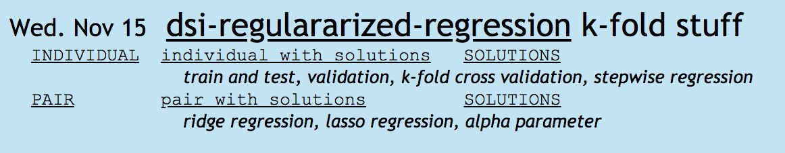

Every day I tried to add the links to the github repos (individual, pair, solutions, and notes) along with some keywords. 

During assessments, I could search by keyword and be taken directly to the repo with code to copy, or to the slides with the answers.

