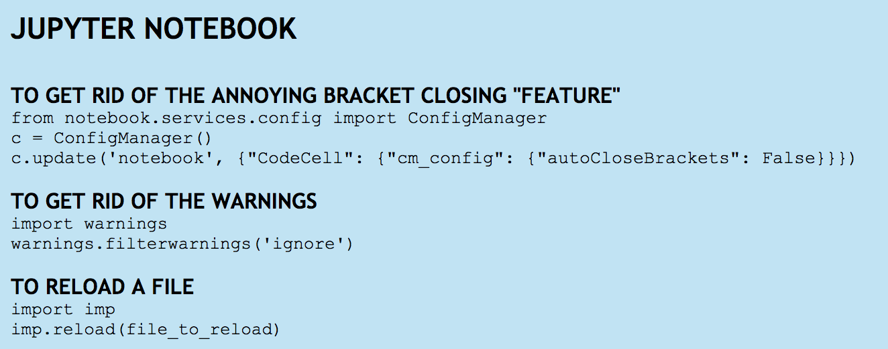
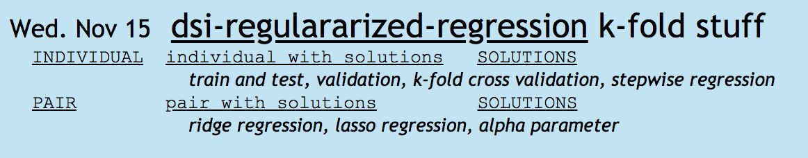
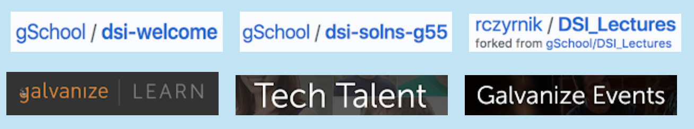

During the program, I created a google site where I tried to keep organized notes. I had separate pages for each topic (Pandas, Numpy, Git Workflow, etc). Below is the page for jupyter notebook. You can see I copied code snippets I expected to need again.

On the main page I kept a calendar. Each day I added the links to the github repos (individual, pair, solutions, and notes) along with some keywords. 

During assessments, I could search by keyword and be taken directly to the repo with code to copy, or to the slides with the answers.

I also kept some of the main links at the top for easy reference.

